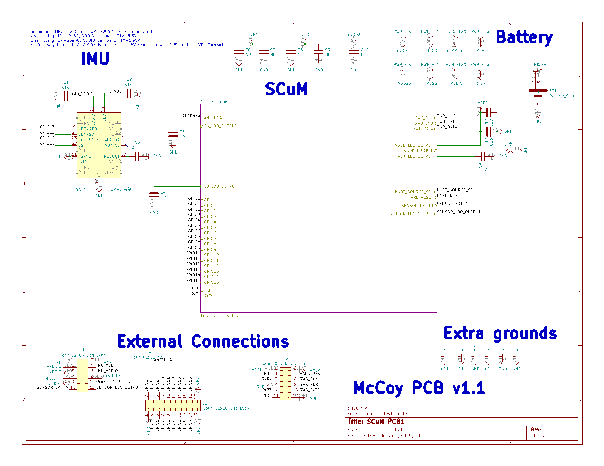
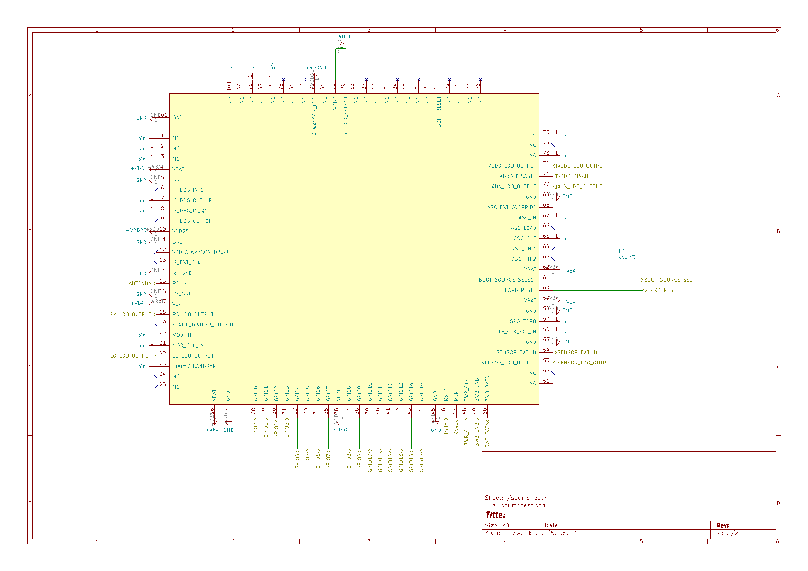
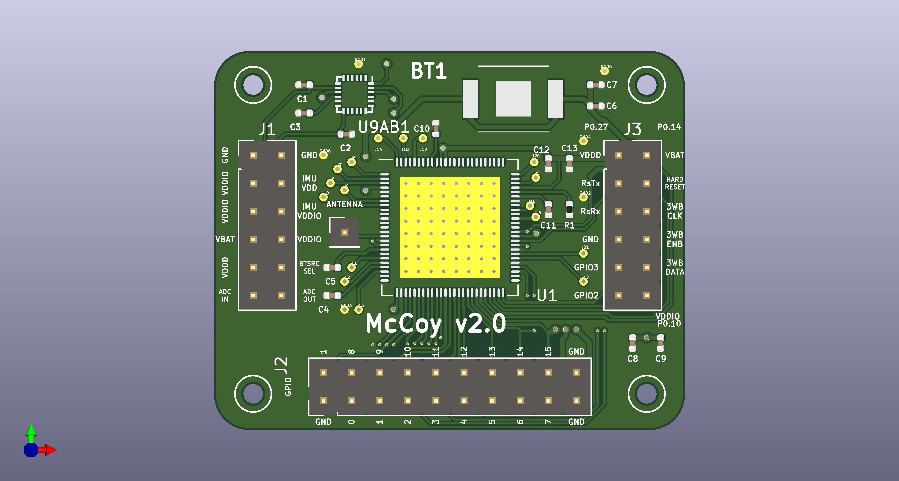
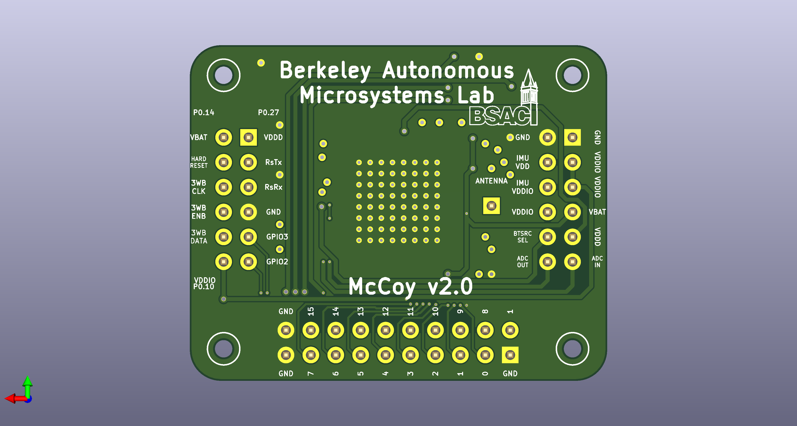

### Updates 2021.04.14
- Austin’s requested layout
- Larger dimensions -- no longers square
- 0.1” pins
- Pins for all GPIOs
- Antenna pin
- Removed I2C for IMU
- Via holes for wiring
- 2 layer instead of 4 layer
- HARD_RESET pin
- GPO_ZERO pin instead of LED
- Swapped GPIO 12 and GPIO 13 on IMU
- Consolidated headers
- Neatened labels

### Updates 2020.12.05
- removed zener diode
- added GPIOs 8, 9, 10
- added ground connections near GPIO
- added labels
- moved passives around
- added ADC pins

### Updates 2020.12.02
- Replaced antenna header with VDDD
- Kept LED
- 0-80 standoffs
- 0.1” -> 0.05” headers
- Removed GPIO 8-15 pins

### Updates 2020.10.07
- 30mm x 30 mm
- holes for standoffs
- SR521SW battery clip
- IMU
- GPIO, 3WB, UART, VBAT, VDDIO pins
- 1.8 V Zener diode for voltage protection
- LED programming indicator

### Updates 2021.01.15
- Added missing BOOT_SOURCE_SEL header

## useful specs
Use 0-80 standoffs. 1.6 mm diameter hole, 3.2 mm diameter clearance. https://www.4pcb.com/pcb-design-specifications/
