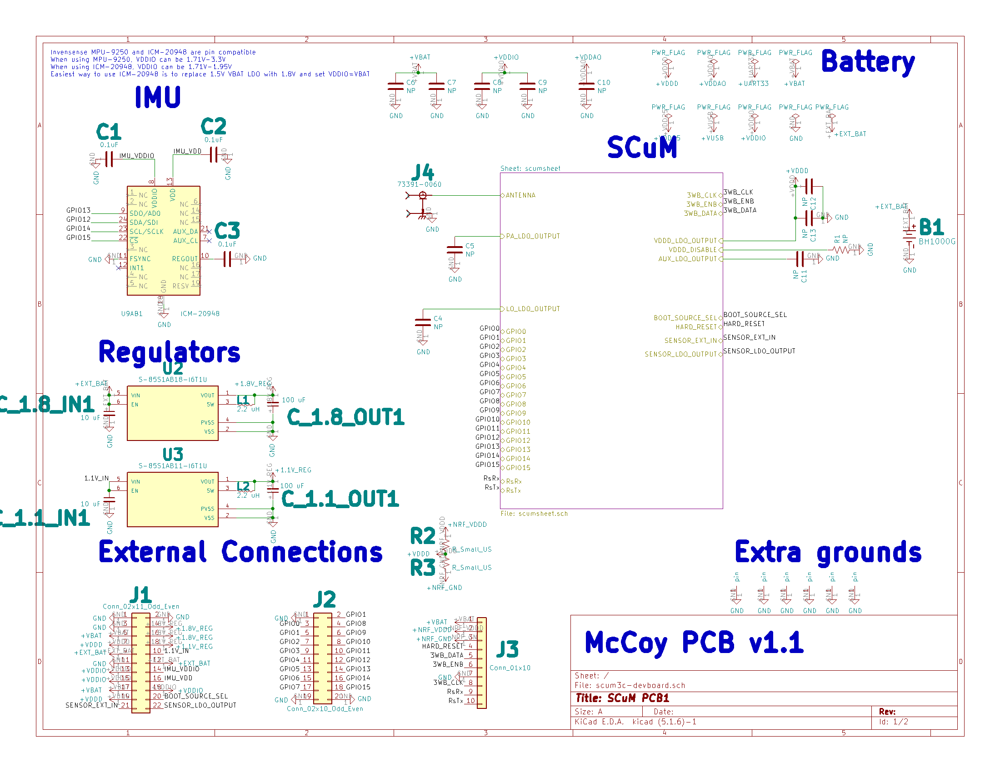
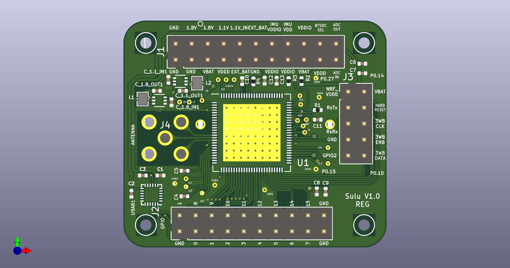
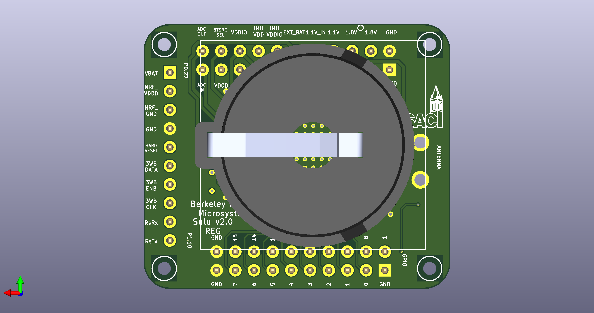

# Changelog
### Update 2021.11.19
- added orientation dots for DC-DC converters and IMU
- Replaced 2x5 header with 1x10 header for nRF interface.

| nRF pin | Sulu pin        |
|---------|-----------------|
| P0.27   | VBAT            |
| P0.26   | NRF_VDDD / HI-Z |
| P0.02   | NRF_GND / HI-Z  |
| GND     | GND             |
| P1.15   | HARD_RESET      |
| P1.14   | 3WB_DATA        |
| P1.13   | 3WB_ENB         |
| P1.12   | 3WB_CLK         |
| P1.11   | RsRx            |
| P1.10   | RsTx            |

### Update 2021.11.04
Replaced DC-DC converter inductor and capacitor footprints to fit with recommended passives from datasheet https://www.ablic.com/en/doc/datasheet/switching_regulator/S85S1A_E.pdf